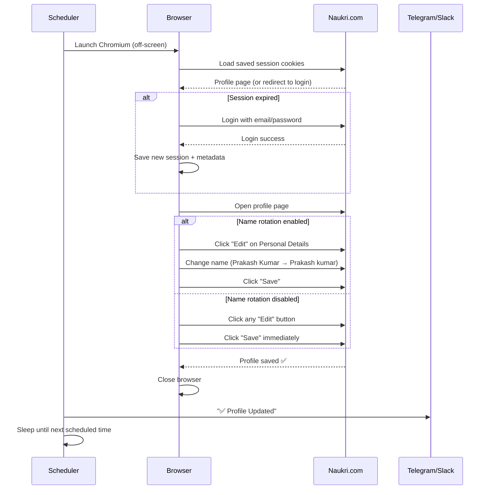
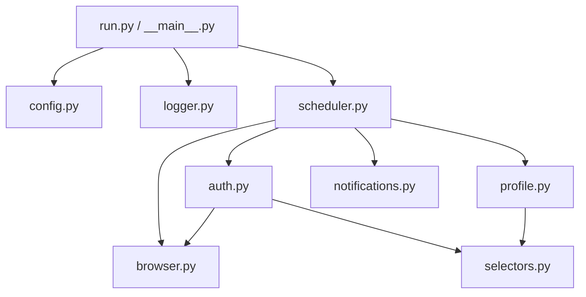

# Naukri Profile Auto-Updater — Complete Guide

> **New here?** This guide will walk you through everything — what this project does, how to set it up, is it safe to use, and how to configure every option. No prior experience needed.

---

## Table of Contents

1. [What Does This Project Do?](#what-does-this-project-do)
2. [How Does It Work? (Simple Explanation)](#how-does-it-work-simple-explanation)
3. [Feature Overview](#feature-overview)
4. [Is It Safe? (Security)](#is-it-safe-security)
5. [Step-by-Step Setup (Windows)](#step-by-step-setup-windows)
6. [Step-by-Step Setup (macOS / Linux)](#step-by-step-setup-macos--linux)
7. [Configuration Reference](#configuration-reference)
8. [Setting Up Notifications](#setting-up-notifications)
9. [Docker Deployment](#docker-deployment)
10. [Running as a Background Service](#running-as-a-background-service)
11. [Troubleshooting (Common Issues)](#troubleshooting-common-issues)
12. [How the Profile Freshness Mechanism Works (Technical)](#how-the-profile-freshness-mechanism-works-technical)
13. [Project Architecture (For Developers)](#project-architecture-for-developers)
14. [Running the Tests](#running-the-tests)
15. [FAQ](#faq)

---

## What Does This Project Do?

**Problem:** On [Naukri.com](https://www.naukri.com) (India's largest job portal), recruiters search for candidates and the search results are ranked by **profile freshness**. If you updated your profile recently, you appear higher. If your profile hasn't been touched in weeks, you sink to the bottom — even if your skills are a perfect match.

**Solution:** This tool automatically logs into your Naukri account every few hours and "saves" your profile. This tricks Naukri into thinking you just updated your profile, keeping you at the top of recruiter searches — without you doing anything.

**Think of it like this:** Imagine you have a shop in a marketplace. Every day, the marketplace rearranges shops so that recently-renovated ones are at the front. This tool "repaints your signboard" every few hours so the marketplace always puts your shop up front.

---

## How Does It Work? (Simple Explanation)

Here's what happens every time the tool runs (e.g., every 4 hours):

```
1. 🌐 Opens an invisible browser (you won't see any window)
2. 🔐 Logs into your Naukri account (or uses saved login from last time)
3. 👤 Goes to your profile page
4. ✏️ Makes a tiny change (like changing "Prakash Kumar" to "Prakash kumar")
5. 💾 Clicks Save
6. 📣 Sends you a notification (optional — via Telegram/Slack/Email)
7. 😴 Goes to sleep until the next scheduled time
8. 🔁 Repeats
```

The name change is so small that no recruiter will notice, but it's enough to tell Naukri "hey, this profile was just updated!"

---

## Feature Overview

| Feature | What It Does | Why It Matters |
|---|---|---|
| ⏰ **Scheduled Updates** | Runs every N minutes or at a fixed daily time | Set it and forget it |
| 🔐 **Session Persistence** | Saves login cookies so you don't re-login every time | Faster, avoids triggering CAPTCHAs |
| 📅 **Session Expiry Tracking** | Detects when cookies expire and re-logs in automatically | No manual intervention needed |
| 🔄 **Name Rotation** | Toggles name between two variants (e.g., uppercase/lowercase) | Creates a real "change" for stronger freshness signal |
| 🔁 **Retry with Backoff** | If it fails, retries 3 times with increasing wait times | Handles temporary network issues gracefully |
| 🚨 **Failure Alerting** | Alerts you after too many consecutive failures | You'll know if something breaks |
| 💬 **Telegram Notifications** | Sends status messages to your Telegram | Check your phone to know it's working |
| 🔔 **Slack/Discord Notifications** | Posts to a Slack or Discord channel | Great for teams |
| 📧 **Email Notifications** | Sends email on success/failure | For those who prefer email |
| 🪟 **Windows Support** | Full support with focus-steal prevention | Browser won't interrupt your work |
| 🍎 **macOS Support** | Full support with AppleScript focus guard | Same — no interruptions |
| 🐧 **Linux Support** | Virtual display (Xvfb) for servers without a screen | Works on headless VPS/cloud servers |
| 🐳 **Docker Support** | One-command deployment | No Python setup needed |
| 🎯 **Centralized Selectors** | All CSS selectors in one file | Easy to fix when Naukri updates their UI |
| 📝 **Colored Logging** | Pretty terminal output with timestamps | Easy to read what's happening |
| 📁 **File Logging** | Optional log file for records | Debug issues later |
| 🧪 **52 Unit Tests** | Automated tests for core logic | Confidence that changes don't break things |

---

## Is It Safe? (Security)

### ✅ What's Safe

| Question | Answer |
|---|---|
| **Does it send my data anywhere?** | **No.** The tool runs 100% on your computer. It only connects to `naukri.com` (to update your profile) and your notification service (if you set one up). |
| **Is there a backend server?** | **No.** No servers, no analytics, no tracking, no telemetry. |
| **Can someone steal my session?** | The session file (`naukri_session.json`) stays on your local disk and is excluded from git. Only someone with access to your computer could read it. |
| **Will my password be on GitHub?** | **No.** The `.env` file (where your password lives) is in `.gitignore` — git will never commit it. |
| **Is the code trustworthy?** | It's fully open source. You can read every line — nothing is hidden or obfuscated. |

### ⚠️ What to Be Aware Of

> **Your Naukri password is stored in a plain text file (`.env`) on your computer.** This is the same way most developer tools handle credentials (Docker, AWS CLI, etc.), but you should be aware of it.

**How to protect yourself:**

1. **Lock your computer** when you step away (Windows: `Win + L`)
2. **Restrict file access** (optional, for extra safety):
   ```powershell
   # Windows — only your user can read .env
   icacls .env /inheritance:r /grant:r "$env:USERNAME:(R)"
   ```
   ```bash
   # macOS/Linux
   chmod 600 .env
   ```
3. **Use a unique password** for Naukri — don't reuse your Gmail/bank password
4. **Never share your `.env` file** with anyone

### ❌ What This Tool Does NOT Do

- Does **not** modify your resume, skills, or work experience
- Does **not** apply to jobs on your behalf
- Does **not** scrape recruiter data or job listings
- Does **not** send your credentials to any third party
- Does **not** download or run any code from the internet

---

## Step-by-Step Setup (Windows)

### Step 1: Install Prerequisites

You need two things installed:

**Python 3.10 or higher:**
1. Go to [python.org/downloads](https://www.python.org/downloads/)
2. Download the latest Python
3. **Important:** During installation, check ✅ **"Add Python to PATH"**

**Git:**
1. Go to [git-scm.com/downloads](https://git-scm.com/downloads)
2. Download and install with default settings

**Verify both are installed** — open PowerShell and run:
```powershell
python --version
# Should show: Python 3.10.x or higher

git --version
# Should show: git version 2.x.x
```

### Step 2: Download the Project

```powershell
cd C:\project
git clone https://github.com/prakash-nitc/naukri-profile-updater.git
cd naukri-profile-updater
```

### Step 3: Set Up a Virtual Environment

A virtual environment keeps this project's dependencies separate from your other Python projects:

```powershell
python -m venv .venv
.venv\Scripts\activate
```

You should see `(.venv)` appear at the start of your terminal prompt. This means the virtual environment is active.

> **Note:** Every time you open a new terminal to run this project, you'll need to activate the environment again with `.venv\Scripts\activate`

### Step 4: Install Dependencies

```powershell
pip install -r requirements.txt
playwright install chromium
```

The first command installs Python libraries. The second downloads a Chromium browser (~150 MB) — this is a one-time download.

### Step 5: Create Your Configuration

```powershell
Copy-Item .env.example .env
```

Now open `.env` in Notepad (or any text editor):
```powershell
notepad .env
```

**Set these two required fields:**
```env
NAUKRI_EMAIL=your_actual_naukri_email@gmail.com
NAUKRI_PASSWORD=your_actual_naukri_password
```

**Save and close the file.**

### Step 6: First Run (With Visible Browser)

For your first run, you want to SEE the browser to make sure everything works. Set this in `.env`:

```env
HEADLESS=false
```

Now run:
```powershell
python run.py
```

**What you should see:**
1. ✅ A Chromium browser window opens
2. ✅ It navigates to the Naukri login page
3. ✅ Your email and password are filled in automatically
4. ✅ It clicks "Login"
5. ✅ Your profile page opens
6. ✅ It clicks an Edit button, then Save
7. ✅ The terminal says: `Profile update completed successfully`
8. ✅ The browser closes

**If you see a CAPTCHA:** Solve it manually in the browser. The session will be saved for future runs.

### Step 7: Switch to Background Mode

Once you've confirmed it works, edit `.env`:

```env
HEADLESS=true
```

Now run again:
```powershell
python run.py
```

This time there's **no visible browser** — it runs completely in the background. The terminal will show logs like:
```
[2025-06-01 09:30:00] INFO     Scheduling update every 240 minute(s).
[2025-06-01 09:30:00] INFO     Running first update immediately...
[2025-06-01 09:30:05] INFO     Profile update completed successfully.
[2025-06-01 09:30:05] INFO     Scheduler started. Press Ctrl+C to stop.
```

**Press Ctrl+C to stop.** See the [Background Service](#running-as-a-background-service) section to keep it running permanently.

---

## Step-by-Step Setup (macOS / Linux)

```bash
# Clone
cd ~/projects
git clone https://github.com/prakash-nitc/naukri-profile-updater.git
cd naukri-profile-updater

# Virtual environment
python3 -m venv .venv
source .venv/bin/activate

# Install
pip install -r requirements.txt
playwright install chromium

# Linux only: install Xvfb for virtual display
sudo apt-get install xvfb   # Ubuntu/Debian

# Configure
cp .env.example .env
nano .env   # Set NAUKRI_EMAIL and NAUKRI_PASSWORD

# Run
python run.py
```

Everything else works the same as Windows.

---

## Configuration Reference

### All Settings at a Glance

| Variable | Required | Default | Description |
|---|---|---|---|
| **Core** | | | |
| `NAUKRI_EMAIL` | ✅ Yes | — | Your Naukri login email |
| `NAUKRI_PASSWORD` | ✅ Yes | — | Your Naukri password |
| `UPDATE_EVERY_MINUTES` | ❌ | `240` | Update interval in minutes (4 hours) |
| `UPDATE_AT_HHMM` | ❌ | — | Fixed daily time, e.g., `09:30` |
| `HEADLESS` | ❌ | `true` | `true` = invisible, `false` = visible browser |
| `PROFILE_URL` | ❌ | Naukri default | Your profile page URL |
| **Session** | | | |
| `USE_SAVED_SESSION` | ❌ | `true` | Reuse saved login cookies |
| `SAVE_SESSION_AFTER_LOGIN` | ❌ | `true` | Save cookies after each login |
| `SESSION_FILE` | ❌ | `naukri_session.json` | Cookie storage file path |
| `SESSION_MAX_AGE_HOURS` | ❌ | `24` | Force re-login after N hours |
| **Name Rotation** | | | |
| `ENABLE_RANDOM_NAME_UPDATE` | ❌ | `false` | Toggle name each cycle |
| `NAME_VARIANT_1` | ❌ | — | e.g., `Prakash Kumar` |
| `NAME_VARIANT_2` | ❌ | — | e.g., `Prakash kumar` |
| **Reliability** | | | |
| `MAX_RETRIES` | ❌ | `3` | Retry attempts per cycle |
| `MAX_CONSECUTIVE_FAILURES` | ❌ | `5` | Alert after N failures in a row |
| **Logging** | | | |
| `LOG_LEVEL` | ❌ | `INFO` | `DEBUG`, `INFO`, `WARNING`, or `ERROR` |
| `LOG_FILE` | ❌ | — | Save logs to file (e.g., `updater.log`) |
| **Notifications** | | | |
| `NOTIFY_WEBHOOK_URL` | ❌ | — | Slack/Discord webhook URL |
| `NOTIFY_TELEGRAM_BOT_TOKEN` | ❌ | — | Telegram bot token |
| `NOTIFY_TELEGRAM_CHAT_ID` | ❌ | — | Your Telegram chat ID |
| `NOTIFY_EMAIL_SMTP_HOST` | ❌ | — | e.g., `smtp.gmail.com` |
| `NOTIFY_EMAIL_SMTP_PORT` | ❌ | `587` | SMTP port |
| `NOTIFY_EMAIL_FROM` | ❌ | — | Sender email |
| `NOTIFY_EMAIL_PASSWORD` | ❌ | — | SMTP password / app password |
| `NOTIFY_EMAIL_TO` | ❌ | — | Recipient email |

> **Important:** Set EITHER `UPDATE_EVERY_MINUTES` OR `UPDATE_AT_HHMM`, never both. If you set neither, it defaults to every 4 hours.

---

## Setting Up Notifications

Notifications are **optional** but highly recommended — they let you know the tool is working without checking logs.

### Option A: Telegram (Recommended — Easiest)

**Time required:** ~2 minutes

1. Open Telegram and message **[@BotFather](https://t.me/botfather)**
2. Send: `/newbot`
3. Follow the prompts (pick a name and username for your bot)
4. BotFather gives you a **bot token** — copy it
5. Now message **[@userinfobot](https://t.me/userinfobot)** — it replies with your **chat ID** — copy it
6. Open your bot's chat in Telegram and press **Start**
7. Add to your `.env`:
   ```env
   NOTIFY_TELEGRAM_BOT_TOKEN=123456:ABC-DEF1234ghIkl-zyx57W2v1u123ew11
   NOTIFY_TELEGRAM_CHAT_ID=987654321
   ```

**What you'll receive:**
- ✅ "Profile Updated" — after each successful update
- ❌ "Update Failed" — when it fails multiple times
- ⚠️ "Recovery" — when it starts working again after failures

### Option B: Slack or Discord Webhook

**For Slack:**
1. Go to [api.slack.com/apps](https://api.slack.com/apps)
2. Create New App → From Scratch
3. Go to "Incoming Webhooks" → Activate → "Add New Webhook to Workspace"
4. Pick a channel → Copy the webhook URL

**For Discord:**
1. Server Settings → Integrations → Webhooks → New Webhook
2. Pick a channel → Copy Webhook URL
3. **Append `/slack` to the URL** (Discord supports Slack-format webhooks)

**Add to `.env`:**
```env
NOTIFY_WEBHOOK_URL=https://hooks.slack.com/services/T00000000/B00000000/XXXX
```

### Option C: Email (Gmail)

1. Go to [myaccount.google.com/apppasswords](https://myaccount.google.com/apppasswords)
   - You need 2FA enabled on your Google account first
2. Select "Mail" → Generate → Copy the 16-character password
3. Add to `.env`:
   ```env
   NOTIFY_EMAIL_SMTP_HOST=smtp.gmail.com
   NOTIFY_EMAIL_SMTP_PORT=587
   NOTIFY_EMAIL_FROM=you@gmail.com
   NOTIFY_EMAIL_PASSWORD=abcd efgh ijkl mnop
   NOTIFY_EMAIL_TO=you@gmail.com
   ```

> **Use a Gmail App Password, NOT your actual Gmail password.** App passwords are separate 16-character codes that only work for specific apps.

---

## Docker Deployment

Docker is the easiest way to run this on any computer. You don't need Python installed — Docker handles everything.

### Prerequisites

Install [Docker Desktop](https://www.docker.com/products/docker-desktop/) for your OS.

### Steps

```bash
# 1. Clone the repo
git clone https://github.com/prakash-nitc/naukri-profile-updater.git
cd naukri-profile-updater

# 2. Configure
cp .env.example .env
# Edit .env with your email, password, and preferences

# 3. Build and start (runs in background)
docker compose up -d --build

# 4. Check it's running
docker compose logs -f
# Press Ctrl+C to stop watching logs (the service keeps running)

# 5. To stop the service
docker compose down
```

**Docker benefits:**
- 🔒 Your `.env` is read at runtime, never baked into the Docker image
- 💾 Session and log files persist across restarts (stored in a Docker volume)
- 🔄 Auto-restarts if it crashes
- 📋 Logs are capped at 10 MB and rotated automatically
- 🖥️ Uses Xvfb virtual display — no visible browser window

---

## Running as a Background Service

By default, the tool runs in your terminal and stops when you close it. Here's how to keep it running permanently:

### Windows: Task Scheduler

1. Press `Win + S`, search for **Task Scheduler**, open it
2. Click **Create Basic Task** (right sidebar)
3. **Name:** `Naukri Profile Updater`
4. **Trigger:** "When the computer starts"
5. **Action:** "Start a program"
   - **Program:** `C:\project\naukri-profile-updater\.venv\Scripts\python.exe`
   - **Add arguments:** `run.py`
   - **Start in:** `C:\project\naukri-profile-updater`
6. Click Finish
7. Find the task in the list → Right-click → Properties
8. Check ✅ **"Run whether user is logged on or not"**
9. Click OK → Enter your Windows password

The tool will now start automatically every time your computer boots.

### macOS / Linux: PM2

```bash
npm install -g pm2
pm2 start run.py --interpreter python3 --name naukri-updater
pm2 save
pm2 startup   # Follow the printed instructions to enable auto-start
```

### Any OS: Docker (Recommended)

Docker automatically restarts the service. See the [Docker section](#docker-deployment) above.

---

## Troubleshooting (Common Issues)

### ❓ "Could not find email field" or CAPTCHA appears

**What happened:** Naukri is showing a CAPTCHA because it detected automated login.

**Fix:**
1. Set `HEADLESS=false` in `.env`
2. Run `python run.py`
3. Solve the CAPTCHA manually in the browser window that opens
4. Let the script complete — it will save the session
5. Set `HEADLESS=true` again — it will reuse the saved session

### ❓ "Login appears unsuccessful"

**Possible causes:**
- Wrong email or password in `.env` — double-check for typos
- CAPTCHA or 2FA required — run with `HEADLESS=false`
- Naukri changed their login page — may need selector updates

### ❓ "Could not find save/edit controls"

**What happened:** Naukri updated their website design and the CSS selectors no longer match.

**Fix:** Open `naukri_updater/selectors.py`, run with `HEADLESS=false`, and use browser DevTools (press F12) to find the correct selectors for the new UI elements.

### ❓ Browser window pops up and steals focus

The tool tries to prevent this, but if it still happens:
- Make sure `LAUNCH_MINIMIZED=true` is set in `.env`
- Or switch to Docker — no browser window at all

### ❓ "ModuleNotFoundError: No module named 'playwright'"

You forgot to activate the virtual environment:
```powershell
.venv\Scripts\activate   # Windows
source .venv/bin/activate  # macOS/Linux
```

### ❓ High memory usage

Chromium uses ~200-400 MB of RAM **during each update cycle only**. The browser is fully closed between cycles. If you're on a low-memory machine, increase `UPDATE_EVERY_MINUTES` to reduce frequency.

---

## How the Profile Freshness Mechanism Works (Technical)



**Why this works:** Naukri's search ranking algorithm uses the "last modified" timestamp of your profile as a major factor. Any save action updates this timestamp. The name rotation strategy (changing one letter's case) creates a *real* data change, which is an even stronger signal than just re-saving without changes.

---

## Project Architecture (For Developers)

The project is split into **7 focused modules** instead of one large script:

```
naukri_updater/
├── __init__.py          # Package version
├── __main__.py          # Entry point (python -m naukri_updater)
├── config.py            # Reads .env, validates, returns typed Config dataclass
├── logger.py            # Colored console logging + optional file logging
├── selectors.py         # All CSS selectors in one place
├── browser.py           # Chromium launch, focus guards, Xvfb
├── auth.py              # Login, session persistence, expiry tracking
├── profile.py           # Profile editing, name rotation, save logic
├── notifications.py     # Webhook, Telegram, Email notification backends
└── scheduler.py         # Schedule loop, retry with backoff, failure tracking
```



**Key design decisions:**
- **Centralized selectors** — When Naukri changes their UI, you only need to edit one file (`selectors.py`)
- **Typed Config dataclass** — All settings are validated at startup, not at runtime
- **Exponential backoff** — Retries at 30s, 60s, 120s instead of hammering a failing server
- **Session expiry sidecar** — A `.meta.json` file tracks when the session was saved, enabling proactive re-login

---

## Running the Tests

```powershell
cd C:\project\naukri-profile-updater
.venv\Scripts\activate
python -m pytest tests/ -v
```

**Expected output: 52 passed** ✅

| Test File | What It Tests |
|---|---|
| `test_config.py` | Config validation, boolean parsing, immutability, schedule conflicts |
| `test_selectors.py` | Selector groups are non-empty, no duplicates, template placeholders |
| `test_notifications.py` | Webhook/Telegram/Email mocking, multi-backend dispatch |
| `test_auth.py` | Session expiry with fresh/stale/missing/corrupted metadata |

---

## FAQ

**Q: Will Naukri ban my account for this?**
A: This tool simulates normal browser usage (opening your profile and clicking Save). It doesn't scrape data, bypass rate limits, or do anything that a human couldn't do. That said, use it at your own discretion and review Naukri's Terms of Service.

**Q: How often should I update?**
A: Every 4 hours (`UPDATE_EVERY_MINUTES=240`) is a good default. More frequent than every hour is probably unnecessary and could look suspicious.

**Q: Can I run this on a cloud server (AWS/DigitalOcean)?**
A: Yes! Use Docker or install Xvfb on Linux. The tool auto-detects headless Linux and uses a virtual display.

**Q: What if Naukri changes their website?**
A: You'll need to update the CSS selectors in `naukri_updater/selectors.py`. Run with `HEADLESS=false` and use browser DevTools (F12) to find the new selectors.

**Q: Can I use this for multiple Naukri accounts?**
A: Not in a single instance. To run multiple accounts, create separate directories with separate `.env` files and run each one independently (or use multiple Docker containers).

**Q: Does it work with Naukri's mobile app?**
A: No, this is browser-based. But the profile freshness signal from the browser applies to your account globally — recruiters will see the updated profile regardless of which platform you use.
