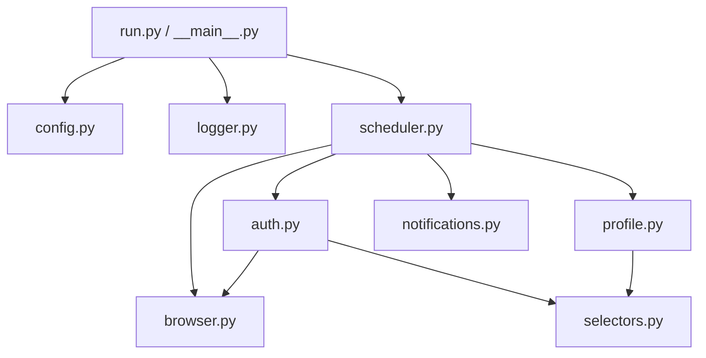

# 🚀 Naukri Profile Auto-Updater

Automatically keep your [Naukri.com](https://www.naukri.com) profile fresh and visible to recruiters — without lifting a finger.

This tool runs in the background on a schedule, opens your Naukri profile, and triggers a save action (or toggles a minor name variant) to signal "profile freshness" to Naukri's ranking algorithm. Fresher profiles appear higher in recruiter searches.

## ✨ Features

| Feature | Description |
|---|---|
| 🔄 **Scheduled Updates** | Run every N minutes or at a fixed daily time |
| 🔐 **Session Management** | Saves and reuses login sessions with automatic expiry tracking |
| 🔁 **Retry with Backoff** | Exponential backoff retries (3 attempts) on failures |
| 📣 **Notifications** | Get alerts via Webhook (Slack/Discord), Telegram, or Email |
| 🪟 **Cross-Platform** | Works on Windows, macOS, and Linux (with Xvfb) |
| 🐳 **Docker Support** | One-command deployment with persistent sessions |
| 🧪 **Test Suite** | Unit tests for config, selectors, notifications, and auth |
| 🎯 **Centralized Selectors** | All CSS selectors in one file for easy maintenance |
| 📝 **Proper Logging** | Colored console output + optional file logging |

## 📁 Project Structure

```
naukri-profile-updater/
├── naukri_updater/            # Main package
│   ├── __init__.py
│   ├── __main__.py            # Entry point (python -m naukri_updater)
│   ├── config.py              # Configuration loading & validation
│   ├── logger.py              # Logging setup with colors
│   ├── selectors.py           # All CSS selectors (centralized)
│   ├── browser.py             # Browser launch & focus management
│   ├── auth.py                # Login & session management
│   ├── profile.py             # Profile update logic
│   ├── notifications.py       # Webhook, Telegram, Email alerts
│   └── scheduler.py           # Scheduling loop with retry logic
├── tests/                     # Test suite
│   ├── conftest.py
│   ├── test_config.py
│   ├── test_selectors.py
│   ├── test_notifications.py
│   └── test_auth.py
├── run.py                     # Simple entry script
├── .env.example               # Configuration template
├── Dockerfile                 # Docker image definition
├── docker-compose.yml         # Docker Compose setup
├── requirements.txt           # Python dependencies
└── pyproject.toml             # Project metadata
```

## 🛠 Setup

### Prerequisites

- Python 3.10+
- pip

### Installation

1. **Clone the repository:**
   ```bash
   git clone https://github.com/YOUR_USERNAME/naukri-profile-updater.git
   cd naukri-profile-updater
   ```

2. **Create and activate a virtual environment:**
   ```bash
   python -m venv .venv
   # Windows
   .venv\Scripts\activate
   # macOS/Linux
   source .venv/bin/activate
   ```

3. **Install dependencies:**
   ```bash
   pip install -r requirements.txt
   playwright install chromium
   ```

4. **Configure your settings:**
   ```bash
   cp .env.example .env
   # Edit .env with your credentials and preferences
   ```

### Configuration Reference

| Variable | Required | Default | Description |
|---|---|---|---|
| `NAUKRI_EMAIL` | ✅ | — | Your Naukri login email |
| `NAUKRI_PASSWORD` | ✅ | — | Your Naukri password |
| `UPDATE_EVERY_MINUTES` | ❌ | `240` | Update interval in minutes |
| `UPDATE_AT_HHMM` | ❌ | — | Fixed daily update time (HH:MM) |
| `HEADLESS` | ❌ | `true` | Run browser in headless mode |
| `SESSION_FILE` | ❌ | `naukri_session.json` | Session state file path |
| `SESSION_MAX_AGE_HOURS` | ❌ | `24` | Re-login after this many hours |
| `ENABLE_RANDOM_NAME_UPDATE` | ❌ | `false` | Toggle name variant each cycle |
| `NAME_VARIANT_1` | ❌ | — | First name variant (e.g., `John Doe`) |
| `NAME_VARIANT_2` | ❌ | — | Second name variant (e.g., `John doe`) |
| `MAX_RETRIES` | ❌ | `3` | Retry attempts per cycle |
| `MAX_CONSECUTIVE_FAILURES` | ❌ | `5` | Failures before alerting |
| `LOG_LEVEL` | ❌ | `INFO` | Logging level (DEBUG/INFO/WARNING/ERROR) |
| `LOG_FILE` | ❌ | — | Optional log file path |

### Notification Setup (Optional)

**Webhook (Slack/Discord):**
```env
NOTIFY_WEBHOOK_URL=https://hooks.slack.com/services/...
```

**Telegram:**
```env
NOTIFY_TELEGRAM_BOT_TOKEN=your_bot_token
NOTIFY_TELEGRAM_CHAT_ID=your_chat_id
```

**Email (SMTP):**
```env
NOTIFY_EMAIL_SMTP_HOST=smtp.gmail.com
NOTIFY_EMAIL_SMTP_PORT=587
NOTIFY_EMAIL_FROM=you@gmail.com
NOTIFY_EMAIL_PASSWORD=your_app_password
NOTIFY_EMAIL_TO=you@gmail.com
```

## 🚀 Usage

### Run Directly

```bash
python run.py
# or
python -m naukri_updater
```

### First Run Recommendation

1. Set `HEADLESS=false` in `.env`
2. Run once and confirm login works
3. Verify the profile save/edit action completes
4. Set `HEADLESS=true` for unattended operation

### Docker

```bash
# Configure
cp .env.example .env
# Edit .env with your settings

# Build and start
docker compose up -d --build

# Watch logs
docker compose logs -f

# Stop
docker compose down
```

**Docker notes:**
- Session and log files persist in a Docker volume (`naukri_data`)
- `HEADLESS=false` is forced — Xvfb handles the virtual display
- `shm_size: 256mb` gives Chromium the shared memory it needs

### Linux Server (No GUI)

On a headless Linux server, the script automatically uses **Xvfb** (virtual display):

```bash
sudo apt-get install xvfb
python run.py
```

## 🧪 Testing

```bash
pip install -r requirements.txt
python -m pytest tests/ -v
```

## 🏗 Architecture



## ⚠️ Important Notes

- **Use responsibly** — review Naukri's Terms of Service before using automation
- **Login can fail** if captcha/2FA is required — run with `HEADLESS=false` first
- **Selectors may break** when Naukri updates their UI — edit `naukri_updater/selectors.py`
- **Credentials** are stored in `.env` (excluded from git) — consider using OS keyring for additional security

## 🙏 Attribution

This project was inspired by and builds upon [naukri_automate](https://github.com/akashpaulworld/naukri_automate) by Akash Paul. The original concept of automating Naukri profile freshness was theirs. This version is a significant rewrite featuring modular architecture, retry logic, notifications, proper logging, tests, and cross-platform support.

## 📄 License

MIT License — see [LICENSE](LICENSE) for details.
